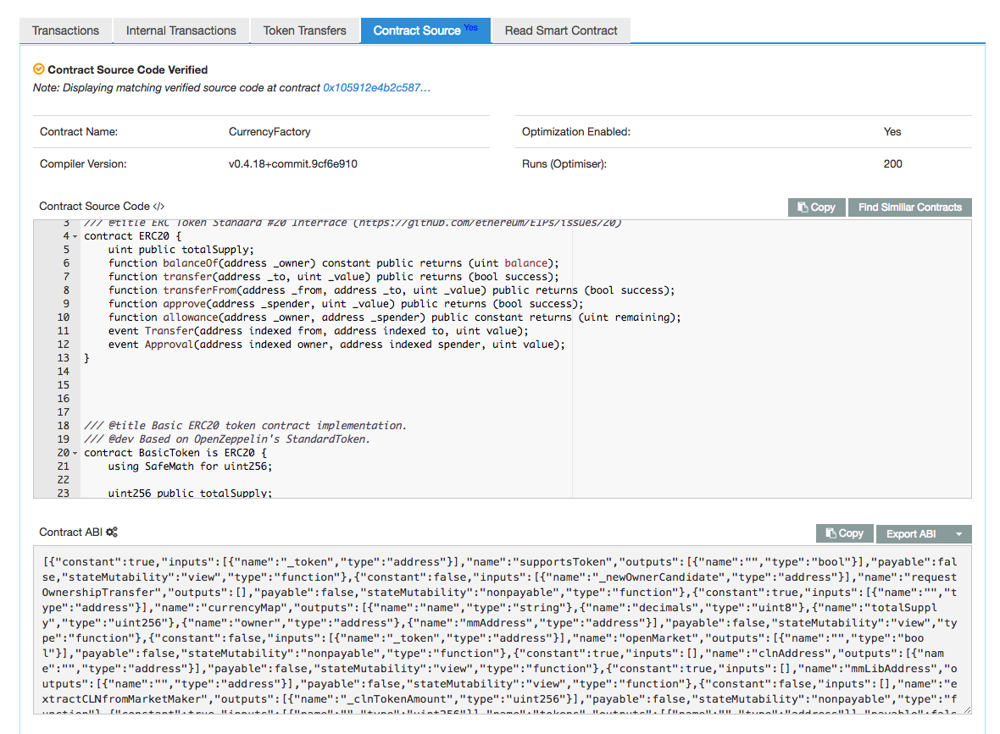
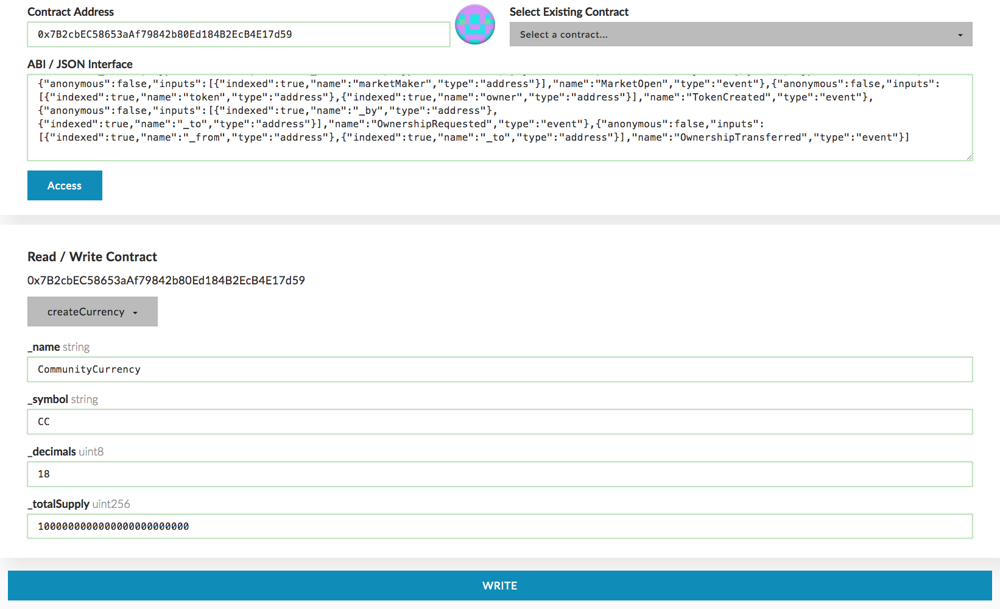
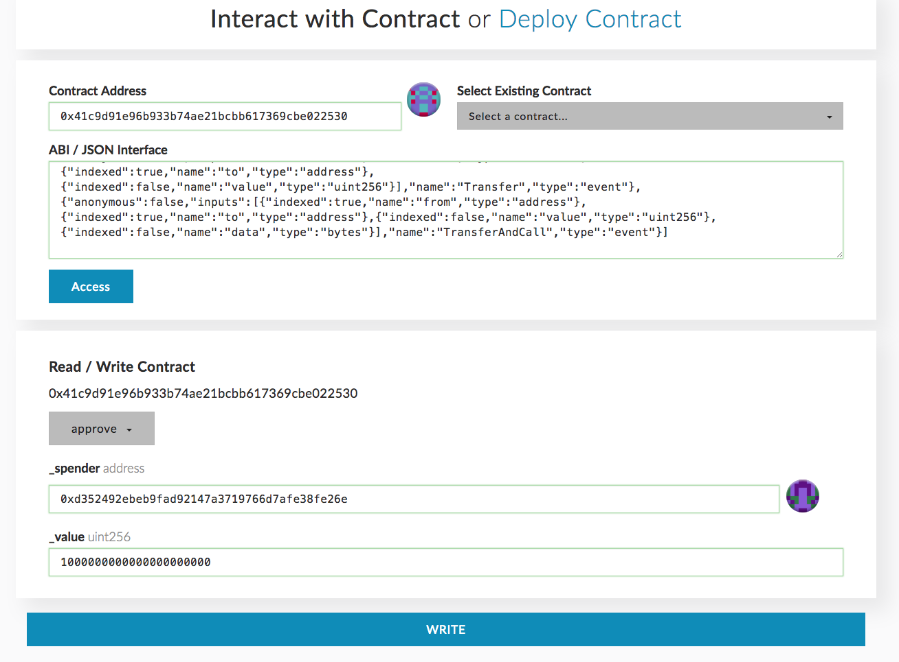

## Community Currency issuance with CurrencyFactory

 Now let's proceed to really interesting stuff of creating new Community Currency. We are going to do this by interacting with the `CurrencyFactory`, one of the contracts created by Colu for currency issuance.

### Community Currency issuance
 In MyEtherWallet I go to the "Contracts" tab, and fill the contracts address. Then I need to get the contract's ABI ([WTF is ABI?](https://github.com/ethereum/wiki/wiki/Ethereum-Contract-ABI)). All of Colu's contracts are verified on Etherscan, so they contain their ABI's in the "Contract Source" tab. I search `CurrencyFactory` address in Etherscan, and copy the ABI from there to paste it in MyEtherWallet "ABI / JSON Interface" field. Pressing "Access" I can select any of the contract's function and the fields to fill in are generated accordingly. MyEtherWallet knows how to do this thanks to the provided ABI.

 This is how it looks at Etherscan:

 

You can go over contract's functionality in MyEtherWallet, or read the [reference](../reference/CurrencyFactory.md) in our docs. The reference also contains developers comments, and we will improve it as time goes by. But we're here to issuance our Community Currency, so let's proceed.

The function to issue a currency is called, not surprisingly, `createCurrency`. You need to specify four parameters to call it: `name`, `symbol`, `decimals` and `totalSupply`. They all are part of the [ERC20](https://theethereum.wiki/w/index.php/ERC20_Token_Standard) token standard. Yes, all community currencies issued by CLN contracts are ERC20-compliant (and [ERC667](https://github.com/ethereum/EIPs/issues/677) also). Generally, this means that they can be easily added and used by any ERC20 wallet.

- I call my currency `CommunityCurrency`
- Set the symbol accordingly to `CC`
- Define decimals to 18 (this is the standard). This means that `CC` token will be divisible to 18 places after the dot.
- Total supply defines how much `CC` tokens will be issued. Let's define a total supply of one million tokens, 1e6 * 1e18 = 1000000000000000000000000. This means that one million "full" `CC` coins will be created, every token divisible up to 18 places.


This is how it looks at MyEtherWallet:



I click on "WRITE". You don't send ETH to any of CLN contracts, so I set the amount to send to 0, and the Gas Limit to 200000. Checking again that I'm on the right network I click Yes.

This is my [transaction](https://ropsten.etherscan.io/tx/0x83e96a696110172da2cf7d0afa11bd7415f6737dbbd51d3055ac609cfe12b206). Looking closely into it you can see that:

- The transaction sent from my account ([0x0d4df041db](https://ropsten.etherscan.io/address/0x0d4df041dbef6ffc0e444a4a213774adb0c118c2)) to the `CurrencyFactory`.
- The internal invoked contract is the new Community Currency. It says that 1000000 `CC` (the total supply) got transferred from `CurrencyFactory` to some [unknown contract](https://ropsten.etherscan.io/address/0xb3f9a85d00fcb75be507da5efc0b91ed221e9bb9).
- My Community Currency contract address is [0x8611c307F3b88040Aa4E73E8e2c5DB303ca81701](https://ropsten.etherscan.io/address/0x8611c307f3b88040aa4e73e8e2c5db303ca81701), save the address of your Community Currency cause we're going to use it soon.

So what happened here?

- `CurrencyFactory` created the CC. As the token creator the `CurrencyFactory` contract was made the owner of all the supply.
- `CurrencyFactory` created the `MarketMaker`, that's the unknown contract we saw! `MarketMaker` is used to exchange CLN/CC. More about it later.
- `CurrencyFactory` moved all CC supply to the `MarketMaker`. As an exchange provider it's reasonable that the MM will hold all the CC.


### Exchanging CLN for CC

Nice, we created a currency but all of it is locked in some `MarketMaker`. We should send CLN to get us some of that crypto-dough. But if we just send CLN to the `MarketMaker` it will have no slightest idea what we want. It will be hard to get this money back, so **don't** do this. Instead, there are two functions on the `CurrencyFactory` that designed exactly for that - `insertCLNtoMarketMaker` and `extractCLNfromMarketMaker`, we need the former.


#### A Few Words About ERC20

Before calling this function I need to approve `CurrencyFactory` to use my CLN tokens. I want to explain the part of ERC20 standard that is relevant for this tutorial. If you understand `approve`, `allowance` and `transferFrom` methods you can skip this section. We start with `approve`:

```
approve(address _spender, uint256 _value) returns (bool success)
Allow _spender to withdraw from your account, multiple times, up to the _value amount
```

Basically, it's like saying to the contract  "Hey contract, if someone named *spender* will try to use up to *value* of my tokens, it's ok, I approve it". In our case *spender* is `CurrencyFactory`. There's also the `allowance` function:


```
allowance (address *_owner*, address *_spender*) constant returns (uint256 remaining)
Returns the amount which _spender is still allowed to withdraw from _owner
```

Also, to withdraw these funds the user (or contract) will have to call `transferFrom`:

```
transferFrom(address _from, address _to, uint256 _value) returns (bool success)
Send _value amount of tokens from address _from to address _to
```


Remember how we called `createCurrency`? Now we'll do the same with the `ColuLocalNetwork` token. I open again the "Contracts" tab of MyEtherWallet, fill in `ColuLocalNetwork` address and upload its ABI. After gaining access to contract's functions, I select `approve`, filling 1000 * 1e18 = 1000000000000000000000 (1000 CLN) as value and `CurrencyFactory` address as the spender. Here's another screenshot, just for you:



I check everything is correct and click send, easy. I didn't use it in the screenshots, but MyEtherWallet also supports the [scientific notation](https://en.wikipedia.org/wiki/Scientific_notation). It means that instead 1000000000000000000000 you can just write 1e21.

There's one more thing you need to know about `approve`. To change the approved amount, first you need to set the allowance to zero (approving zero for this account) and then send approve again with the new value. Otherwise your transaction will fail without a reason (like every failed transaction in Ethereum). This is done to prevent a special kind of attack, [look here](https://github.com/ethereum/EIPs/blob/master/EIPS/eip-20.md#approve ) for more info.

#### Inserting CLN to the CurrencyFactory


After the `approve` transaction is confirmed I can eventually call `insertCLNtoMarketMaker`. I do the same process again, this time for `CurrencyFactory`, and after the ABI is loaded I select `insertCLNtoMarketMaker` function. There's actually two functions with the same name (this is Solidity's function overloading feature), and I need the one that received both `token` and `clnAmount`. Maybe we'll talk later about the second one. In the token field I paste the `CommunityCurrency`'s address, and put the same 1000 * 1e18 for the amount field.

Viewing the [transaction](https://ropsten.etherscan.io/tx/0x350fe7bad490baa8a0446c8f5f76bb913b8238fcd882832bb7b4b3e354d1b9c6) you may think some complex stuff happened there. Well, I'll try to sum it up.

- `CurrencyFactory` transfers the CLN to itself. `CurrencyFactory` can do this cause I gave it an allowance for that before.
- Then it transfers the tokens to `MarketMaker` letting him do his mathematical magic. More technically speaking it approves the `MM` to use `CLN`, and calls `MM`'s  `change` function.
- In return the `CurrencyFactory` receives `CC` tokens.
- It sends the tokens back to the sender.

As you see, `CurrencyFactory` is really just an intermediary that calls `MarketMaker` and holds some data about issuances. The bottom line is I've got around 1,139 `CC` for 1000 `CLN`. Now I'll add my `CC` token to MyEtherWallet, so I can easily see my tokens. I encourage you to do this with your Community Currency also, just for fun as I say.

You can call `insertCLNtoMarketMaker` multiple times, exchanging more CLN for your home-baked Community Currency. By the way did you notice that the CLN/CC exchange rate changes? This is because as you exchange more CLN for CC, your CC becomes more valuable and so it's price grows. That's how `MarketMaker` works, we'll get into it in the second part of the tutorial.

You call `extractCLNfromMarketMaker` to get your CLN back. If you exchange all your CC to CLN you'll get the initial CLN amount, no CLN lost.

### Finish and open the market

Only token issuer can call `insertCLNtoMarketMaker` and `extractCLNtoMarketMaker`. For everyone else to be able to exchange CLN/CC we need to open the CC's `MarketMaker` for public usage. This is done to give sufficient time for the currency issuer. As I explained before CLN/CC rate depends on the CC demand. When the token is just created the demand for CC is low, so the currency issuer has an advantage to buy CLN for the cheapest price. Other preparations might not be related to crypto at all.

When issuer is ready he releases the Community Currency to the world. Let's call the function `openMarket` of the `CurrencyFactory`, giving it `CC`'s address as the argument. After the [transaction](https://ropsten.etherscan.io/tx/0x5e86f8ab823098065f7e6c172e3b3f9baaea280c9125d56b6639b7b666d8fe18) is confirmed anyone can use the `MarketMaker` contract, and the issuer has no advantage on other participants. We will learn more about `MarketMaker` functions and internal mechanism in the second part of this tutorial.
