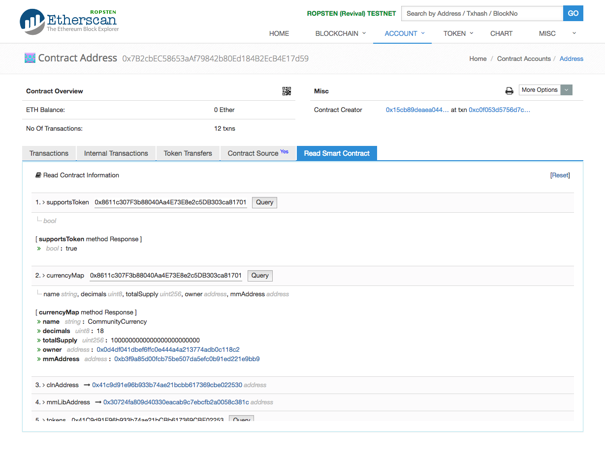
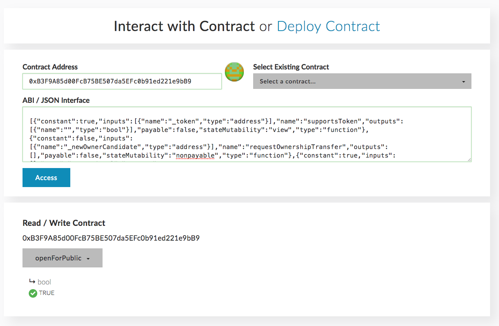
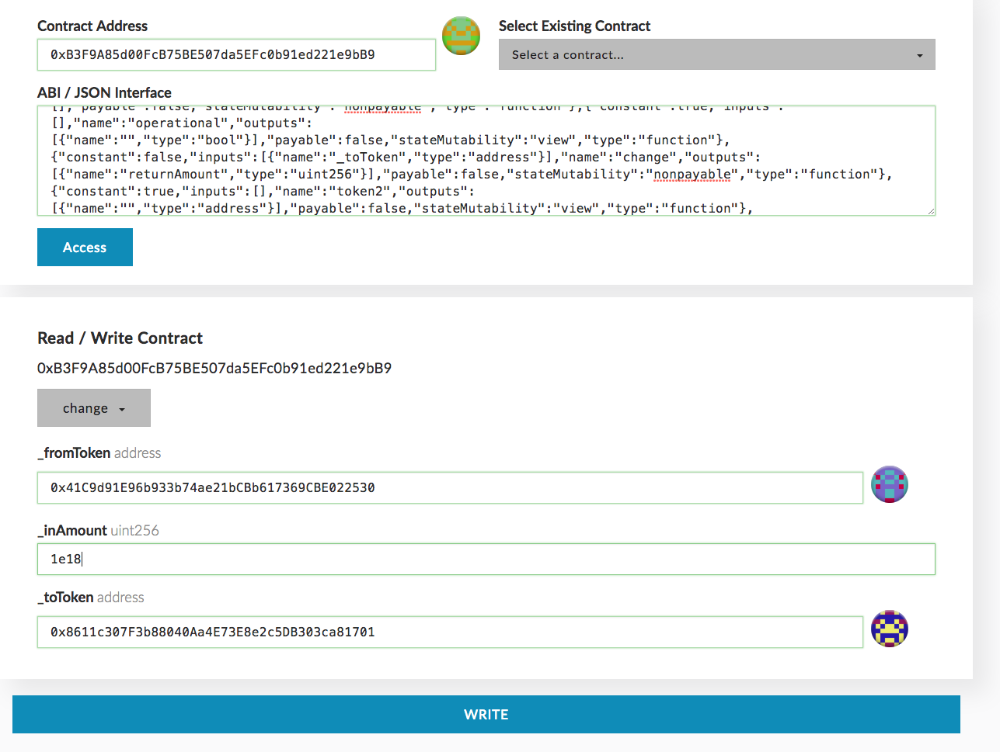
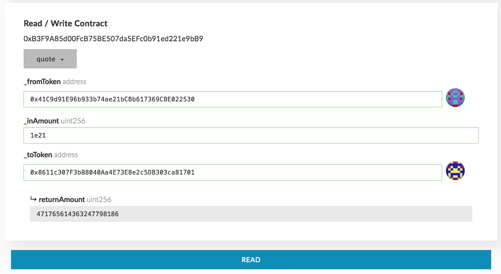
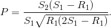
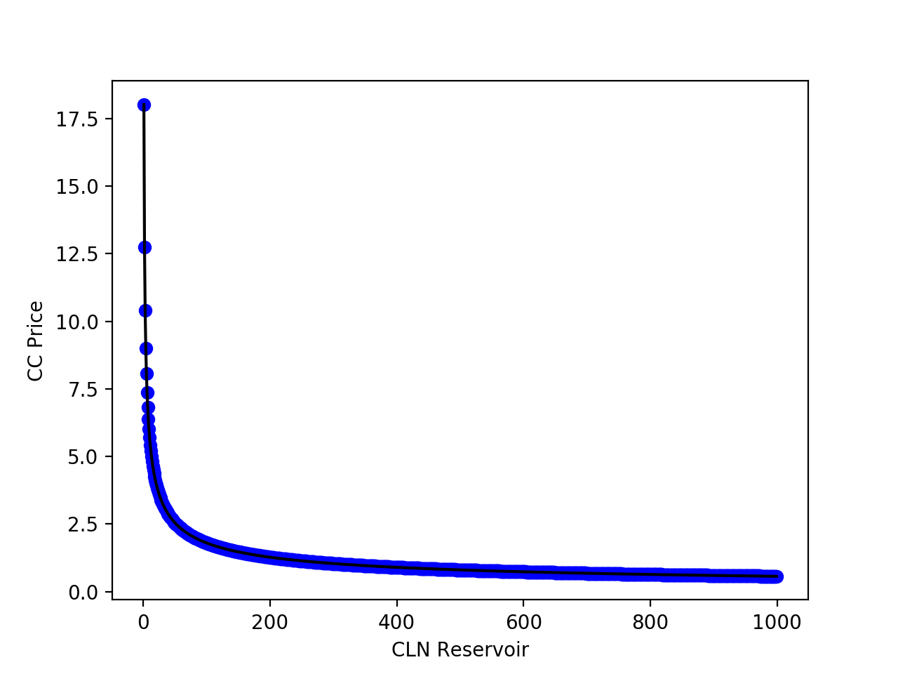
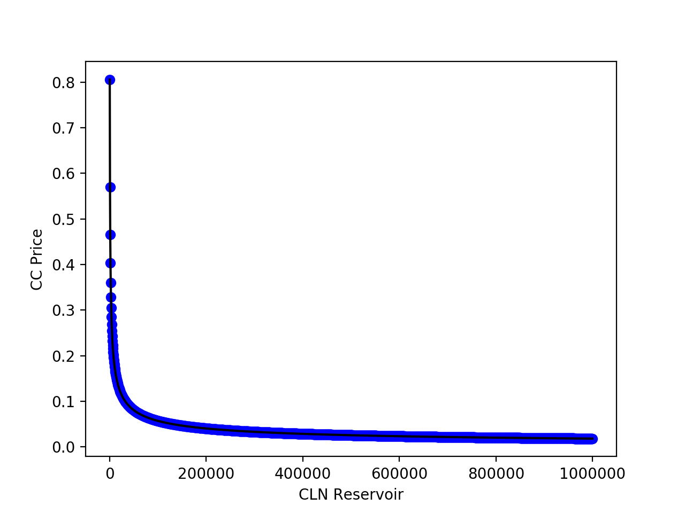
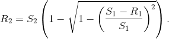

# Mechanical Market Maker

## Concept Introduction

What is a market maker, or should I say who is this? Let's look into [wikipedia](https://en.wikipedia.org/wiki/Market_maker) for a proper definition:

>A market maker or liquidity provider is a company or an individual that quotes both a buy and a sell price in a financial instrument or commodity held in inventory, hoping to make a profit on the bid-offer spread, or turn

Maybe some of the readers are proficient in economy, but I suppose some are not. So before writing about Colu's market making I'd like to explain this broad definition.

To "quote" just means to give a specific price for a commodity. And the market maker gives both buy and sell prices. While most of the traders buy or sell a commodity, the market maker is willing to do both. Strange, but let's give an example everyone is acquainted with - the dollar/"your local currency" exchange booth. When I traveled to Mexico I used them multiple times along the way, trading dollars to pesos. Each one of them have provided a different exchange rate and it was kind of hard to find an optimal one. You can read more about [spread](https://en.wikipedia.org/wiki/Bid%E2%80%93ask_spread), but I guess you can imagine how these guys make money.


Giving both buy and sell prices is what "builds the market", making the commodity easily tradable. Without such exchange booths, it would be pretty hard to exchange currencies. Especially for tourists who don't have much connections in the country. This leads to the notion of [liquidity](https://www.investopedia.com/terms/l/liquidity.asp):

> Degree to which an asset or security can be quickly bought or sold (Investopedia)

Currencies and stocks have got high liquidity that supported by various market players, they are very fast to exchange. Real estate liquidity is much lower, for example it takes much more effort to sell a house. To be useful, currency should have a superb liquidity, and there's were community currencies in general fail. A community currency have got a limited amount of holders by it's definition. As you saw in the [previous part](1_CurrencyFactory.md) it can be just the issuer.

It was a crucial issue to solve to get the local economy running. So the autonomous liquidity provider, or how we call it - a Mechanical Market Maker, was initiated. Mechanical Market Maker provides immediate exchange between CLN and the Community Currency, while the exchange rate is calculated by a mathematical formula. With every Community Currency issued, a dedicated Market Maker is created. In contrast to market maker's definition, this Market Maker doesn't make profit, but solely provides liquidity. As we saw in the previous part, extracting CLN from the `CurrencyFactory` resulted in the initial amount of CLN. Implemented as smart contract you only pay for Gas to subsist the Ethereum platform.

Colu is not the only one in the autonomous liquidity domain. With the evolution of smart contracts, many others like [Bancor](https://www.bancor.network/) or [Stablecoin](http://cdetr.io/smart-markets/), have presented their ideas, formulas and liquidity providers. Though every technology must be viewed in the context of the problem it solves. Infinite number of formulas are possible, but our aim was to conceive one that assist in the development of local communities.


### Recap

After such an introduction, let's get back technical. In the last chapter we issued a new currency and exchanged CLN to CC calling `insertCLNtoMarketMaker`. Do you remember that [transaction](https://ropsten.etherscan.io/tx/0x350fe7bad490baa8a0446c8f5f76bb913b8238fcd882832bb7b4b3e354d1b9c6)? Here I exchanged 1000 CLN for ~1339 CC. But if the currency was created with a different supply, the exchange rate is going to be different too. [Mark](https://twitter.com/smargon), for example, [created](https://etherscan.io/tx/0xe444c7b274e937bf97484d480c6eb5d0859e5754164ea911c68138280364234d) a currency with a total supply of 10,000. So for 100 CLN he [received](https://etherscan.io/tx/0xb565b4f820efd0298158d023a43ef28b9cfc5caf62b4a1fc17bf0169a324003f) only ~3 TAC (his Community Currency). We will dive soon into the "why", but the intuition here is because his currency has much smaller supply, every TAC token is much more valuable than my CC.


In the last tutorial's chapter we eventually open the market for public. As a recap let's explore `CurrencyFactory` through Etherscan's [Read Smart Contract](https://ropsten.etherscan.io/address/0x7b2cbec58653aaf79842b80ed184b2ecb4e17d59#readContract) tab. Here you see contract's data and the read-only functions that can be called because they don't mutate the contract's state. My CC address is `0x8611c307F3b88040Aa4E73E8e2c5DB303ca81701`, let's see if `CurrencyFactory` supports this token. I fill this address in the field next to `supportsToken` function and press query. Here's how it looks:



You can see that the answer for `supportsToken` is `true`. So we're good. CLN and all tokens that were created using the `CurrencyFactory` are supported. After that I put the same address and query the `currencyMap`, and receive data related to the currency: name, decimals, totalSupply, etc. You can see it above, under "[currencyMap method Response]". I can be assured that this is indeed the currency I created cause I'm the owner. This is also a quick way to get `MarketMaker` address, it appears as `mmAddress` field.

## Interacting the Market Maker

I created a new Ethereum [account](https://ropsten.etherscan.io/address/0x28ef70800b19b3bf15bf8210f351a95f15613aeb) and transferred there some CLN and Ether. While my first account was the token issuer, that one represents a community member.

Now let's interact directly with the `MarketMaker` contract. Opening the contract in Etherscan I see it's not verified and there's no ABI in the "Contract Code" tab, just the bytecode. Why is that :confused:? If we remember the first part, that contract was created by the `CurrencyFactory` when I issued the Community Currency. Contract verification is a process done manually by a developer (most of the time), we can't expect every contract to be verified.

Fortunately, `MarketMaker`'s logic sits in the [EllipseMarketMakerLib](../reference/EllipseMarketMakerLib.md) contract. Every dedicated `MarketMaker` holds data that relates to the concrete Community Currency, but uses the logic of `EllipseMarketMakerLib` to calculate the exchange rate. This makes creation of new currencies relatively inexpensive, because less logic in contract means less data, means less fees. In particular, this means that `EllipseMarketMakerLib` [contract](https://ropsten.etherscan.io/address/0x30724fa809d40330eacab9c7ebcfb2a0058c381c#code) and `MarketMaker` have the same ABI. So I use `EllipseMarketMakerLib`'s' ABI for the contract address of my `MarketMaker`. Here's a screenshot to bear the confusion you might have:



Also you can see that I call contract's function  `openForPublic`, to be sure that I can exchange CLN/CC through this contract. I'm not sending a transaction because it's a `view` (read-only) function, but we already used `view` functions before when we interacted with `CurrencyFactory` on Etherscan. These function calls interact with the Ethereum platform trough [JSON-RPC](https://github.com/ethereum/wiki/wiki/JSON-RPC) and don't get propagated to every node, so there's no Gas to pay.

Another `view` function I want to try is `getCurrentPrice`, calling it I get an answer of 569672901914775677. This means that for 1 CLN we get 569672901914775677 / 1e18 = ~0.57 CC. It's a bit clumsy, but was implemented that way because Solidity's lack of support for real numbers.


Just like I did in part one of the tutorial, I need to approve `MarketMaker` to use my CLN. I call `approve` function of [ColuLocalNetwork](../reference/ColuLocalNetwork.md) contract, fill in the amount I wish to exchange and specify `MarketMaker` address as the spender. If you aren't sure why we're doing this, please read "A Few Words About ERC20" section of the first part.

Investigating [transaction's](https://ropsten.etherscan.io/tx/0x4d59b4e0dfe3e853e94e0515bda6a0cac921b5db54ad52b2edf950d7c1c574d4) arguments you can see that the first one is my `MarketMaker` address - `000000000000000000000000b3f9a85d00fcb75be507da5efc0b91ed221e9bb9` and the second is the amount in hex (0xde0b6b3a7640000 = 1e18).


The function that exchanges CLN/CC is called, surprisingly, `change`. There are multiple implementations with different arguments, I choose one that takes 3 arguments:
-  `_fromToken` -  [ColuLocalNetwork](../reference/ColuLocalNetwork.md) address.
-  `_inAmount` - the amount of tokens I want to exchange.
-  `_toToken` - the address of my `CommunityCurrency`



Let's sign and send the transaction. Oh, look at [that](https://ropsten.etherscan.io/tx/0x9e3ef01e47e4a1d6af4d1fbcbcca6f0b7ed287476bddd7a26c174e97ae68788d), I did receive ~0.57 CC in exchange of 1 CLN.

Let's check again the CLN/CC exchange rate, I call `getCurrentPrice` again and get a slightly different price! It returns now 569388278636115886, the delta is 569672901914775677 - 569388278636115886 = 284623278659791. We need to divide it by 1e18, so it gives a change of 0.00028. This means that now we receive less CC for CLN. It's small, but we see that our CC is getting more expensive. That's the Mechanical Market Maker in action

The most observant of you might have noticed that in the last transaction I exchanged 1 CLN for 0.56953055471532534 CC. Let's multiply it by 1e18 to align with other values. 0.56953055471532534 * 1e18 = 569530554715325340, I call this `actualRate`. Then:

> 569672901914775677 > 569530554715325340 > 569388278636115886

Which means:

> getCurrentPrice_before > actualRate > getCurrentPrice_after

I see that actually I exchanged for a slightly different rate than `getCurrentPrice`. Is someone fooling around with me :monkey_face:?

The exchange rate of CLN/CC is a function with multiple variables, we'll get to this later. What's important to grasp is that it's defined continuously for every wei (smallest indivisible unit) in the domain. So the exchange rate changes with every inserted wei of CLN. When I inserted 1 CLN It was actually 1e18 wei, and every wei got exchanged for an individual price. If it reminds you of something you're right - it's good old calculus. To calculate the `actualRate`, I need to calculate a definite integral of the `getCurrentPrice` function. I stop myself here and refer you to [whitepaper's appendix](https://cln.network/pdf/cln_whitepaper.pdf) for a complete explanation.


But actually there's a simple way. I'll explain how it works in the next section, for now we just use the `quote` function. It calculates the exact amount of CC you will get for the specific amount of CLN (and vice versa). Let's say I want to buy 1000 CLN (1e21 wei), first I do:



It means that now for 1000 CLN I'm getting 471765614363247798186 / 1e18 = ~471.76 CC. Do you remember that in the first part I've got 1139 CC for 1000 CLN? That change is pretty rough because there's an edge case when the CC is issued (no CLN have been inserted).

Now after I know for sure how much CC I'll get for 1000 CLN, let's do the trade. But what if between the time when I checked the quote and called `change` function, someone else exchanged CLN to CC before me? I'll get different CC amount! Sometimes it can be more (if CC is traded for CLN), but sometimes less. Am I ok with less? If yes how much less I'm ok with? Of course this difference is significant only on some edge cases, but we got that covered too.

First, let's approve 1000 CLN for the `MarketMaker`'s allowance. After this is done I'll take again `EllipseMarketMakerLib` ABI to contact with my dedicated `MarketMaker`. Now I'm going to call a different implementation of `change`. One that receives 4 arguments, 3 of them are the same and `minReturn` is the new one. With this argument I specify the minimum amount of tokens I agree to receive in return. If the exchange rate changed and I'm going to receive less than `minReturn`, the deal is canceled and the transaction is reverted. I just pay for the Gas.

I want to make sure that I don't get less than the value that was promised by `quote`. So I fill 471765614363247798186 (`quote`'s answer') in `minReturn` argument. After a while, checking the [transaction](https://ropsten.etherscan.io/tx/0x6c711ea96f507a8e71330fb5a3f4b675c81eda3083a2b2b707217802f199e673) I see that this is exactly the amount of tokens I got. Looks solid.

Now let's try to exchange another 1000 CLN for the same exchange rate. I know this is impossible but for once I want to demonstrate you a failing transaction. Actually Ethereum doesn't give a reason why the [transaction failed](https://ropsten.etherscan.io/tx/0x1bc68cacb5bf67dcb0d3c0ee8eedf124171aadeaaa52f5107f5806649aa31a05), so you should trust me on that one. But when I run again `quote` for 1000 CLN I get a `returnAmount` of ~366 CC, so this makes sense.


## The Math Behind

The last thing I want to cover is the formula itself. If you want to have a deep understanding of the math I advise you to read the whitepaper's [appendix](https://cln.network/pdf/cln_whitepaper.pdf).

### The Ellipse

Theoretically, the Market Maker can work with any pair of currencies, but for our use case the first currency is always CLN and the second one is the Community Currency. As I explained before, there are multiple Community Currencies with a dedicated Market Maker for each one. But each CC uses CLN as backup currency, so through CLN you can exchange CC1 for CC2 in two hops.

There are four variables that affect the exchange rate:
- S1 - total supply of the first currency, the CLN. Namely, the number of CLN tokens issued, we can consider it as a constant.
- S2 - total supply of the second currency, the CC. It's defined when the currency is created, and is also a constant.
- R1 - the reservoir of the first currency held by the Market Maker. Initially it's zero cause no CLN is inserted.
- R2 - the reservoir of the second currency held by the Market Maker. Initially all the CC's total supply is in the reservoir, so R2 = S2.

These four variables should apply to the formula:


As I said, S1 and S2 are constants. So if denoted `x = S1 - R1` and `y = S2 - R2`, we get an [ellipse equation](https://en.wikipedia.org/wiki/Ellipse#Equation), that's why the contract is called Ellipse Market Maker :open_mouth: !

Let's check that the formula holds at least for a couple of cases:

#### Issuance
After the issuance we know that:

```
R1 = 0
R2 = S2
```

Let's substitute this to the formula
```
=> (S1 / S1) + (S2 - S2 / S2) = 1

=> 1 = 1
```
Q.E.D. :white_check_mark:

#### 1000 CLN inserted

Let's take the parameters from the issuance in tutorial's first part. The constants are:


```
S1 = 1540701333592592592592614116
S2 = 1e24
 ```

I inserted 1000 CLN to the R1 reservoir and got back ~1139 CC from R2 reserve. That say:

```
R1 = 1e21
R2 = 1e24 - 1,139.346173578872162244e18 = 9.988606538264211e23
```


After the substitution we see that the first part of the formula is really close to 1 and the second part close to 0:

```
~1 + ~0 = 1
```
Q.E.D. :white_check_mark:


### Current Price Formula

Showing you just the derived formula for `getCurrentPrice`, it is:



Oh don't ask me how we did this (read the whitepaper). The important thing here is because S1 and S2 are constants, price is expressed as a function of R1. And this is great because, as you know, one variable functions are simple and easy to use.

##### getCurrentPrice_before

That's the first time we checked `getCurrentPrice`. I inserted 1000 CLN before so all variables from last section still hold. I substitute the variables and calculate:

```
price = 0.5696729019147757
```

Comparing this price to a `getCurrentPrice` answer, we're getting a really close numbers. I did my calculations using python, which uses floating point to store real numbers, while Solidity stores all numbers as natural ones. This makes Solidity's calculation more accurate than mine. Python even doesn't see the difference between the two results, but calculating the diff in [wolframalpha](http://www.wolframalpha.com/input/?i=569672901914775677+%2F+1e18+-+0.5696729019147757) I can see that the diff is `-2.3e-17`. I hope it shows that the contract's calculations are more accurate than mine :sweat_smile:.

 I think you're getting the point and can calculate `getCurrentPrice_after` by yourself :wink:. But I want to assure you that the price is much more stable than we saw. `getCurrentPrice` returns the exchange rate of CLN to CC, as we saw that gave us  `1 CLN => ~0.57 CC`. I wish to present a reverse exchange of CC to CLN, to show CC's growth of value. The formula for that is just `1 / getCurrentPrice`, now let's see some graphs I've drawn.

 CC Price with CLN reservoir from 1 to 10000 CLN:

 

As you see, initially the price climbs steeply, but then the amplitude kind of stays the same.

That's the same function over the domain of 1 to 1e6:



It's important to note that the maximum for CLN reserve is S1 and not 1e6, but you see the pattern. I call this pretty stable.

### Calculating Quote

As we saw before, `quote` function calculates how much of token1 received in exchange for certain amount of token2. For now we are interested in exchange of CLN to CC, but the CC to CLN exchange is calculated in the same way. Let's follow `quote` logic and calculate ourselves how much CLN I received in return.

If we poke a little the ellipse equation we can present a formula for R2:




This is the formula that `quote` internally uses, it's even implemented in the smart contract as `calcReserve` function.

Before, I inserted 1000 CLN through `CurrencyFactory` and 1 CLN through `MarketMaker` directly. So whereas I want to insert another 1000 CLN, `MarketMaker` was already holding 1001 CLN. So we have:

```
S1 = 1540701333592592592592614116
S2 = 1e24
R1 = 2.001e21
R2_before = 1e24 - 1,139.346173578872162244e18 - 0.56953055471532534e18
=> R2_before = 9.98860084295866412512416e23
```

It turns out we have bounded values for S1, S2 and R1. This leaves R2 the only free variable with one positive value to satisfy the equation.

I've got tired of working with python because of the accuracy problem, so I'll do the math this time in wolframalpha. As you can <a href="http://www.wolframalpha.com/input/?i=1e24+(1+-+sqrt(1+-+((1540701333592592592592614116+-+2.001e21)+%2F+1540701333592592592592614116)+%5E+2)">see</a>:

```
R2_after = 9.983883186815031647142304e23

```

Wow that precision is very very good. Let's calculate the change of R2, this delta is the amount of tokens I will receive in exchange, exactly what I was looking for.


```
delta_R2 = R2_before - R2_after = 4.717656143632477981856e20
```

It's very close to the value retrieved by `quote`. So are we good? I think we are.

That's not all, but that's all for now. See you at part 3 when we learn about the currency crowdfunding with `IssuanceFactory` :smiley:
